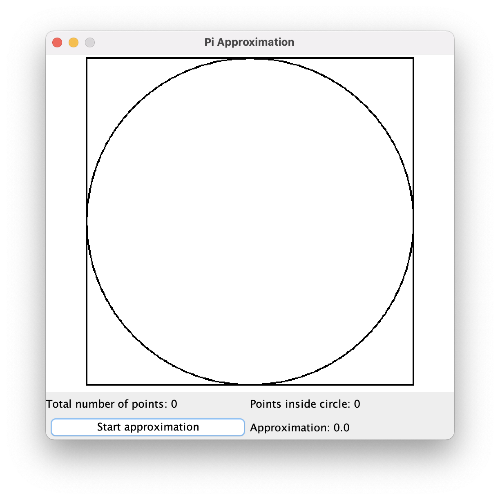
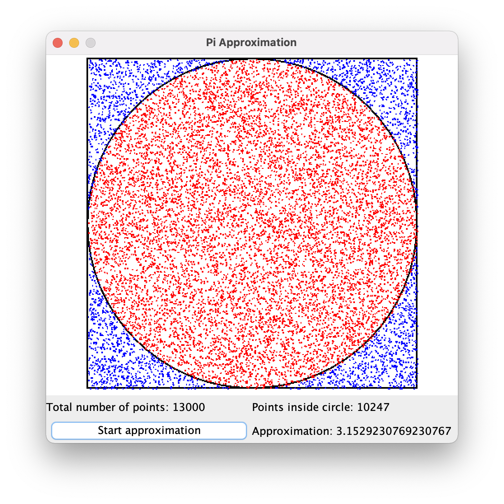

# PiApproximation

Approximation of pi using random number generator.  

A circle of radius r is inside a square of length `2*r`  
The area of this circle is `pi*r*r`  
The area of this square is `(2*r)*(2*r)` = `4*r*r`  

Area ratio is equals `pi/4`  
We can approximate pi. Number pi equals `4 * area ratio`.  
We need to find area ratio for some circle and square.  

We can do this by generating points inside square.  
Area ratio is equals to number of points inside circle divided by total number of points.  

Examples:  

